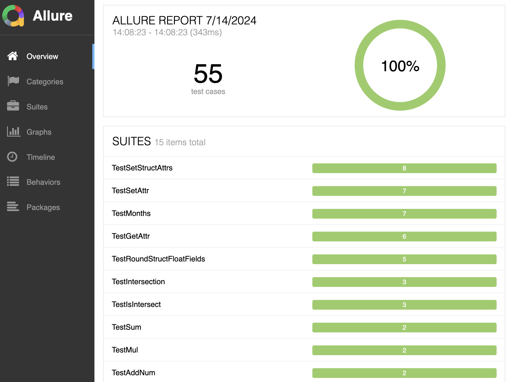

# Tools-go


[](https://codecov.io/gh/ruauka/tools-go)
[](https://github.com/ruauka/tools-go/actions/workflows/pipeline.yml)
[](https://godoc.org/github.com/ruauka/tools-go)

## Overview

The tool contains some useful packages:

- Attrs - changing and rounding `struct fields` (`getattr`, `setattr`, etc...);
- Rtime - counting `time`;
- Rslices - work with `slices`;
- Asm - optimization for `slices` using `Go Assembly`, `SIMD`;

## Install

To install the package run:

```bash
go get github.com/ruauka/tools-go
```

## Update

To update the package run:

```bash
go get -u github.com/ruauka/tools-go
```

## Usage

- [Attrs](attrs/README.md)
- [Rtime](rtime/README.md)
- [Rslices](rslices/README.md)
- [Asm](asm/README.md)

## Allure:
<p align="left">
    
</p>
